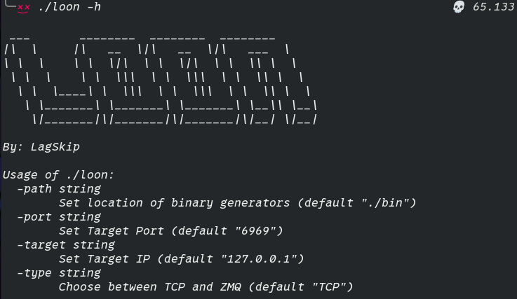
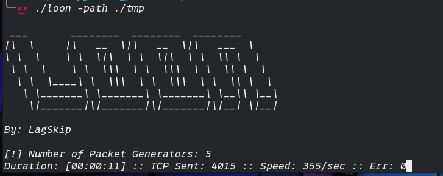
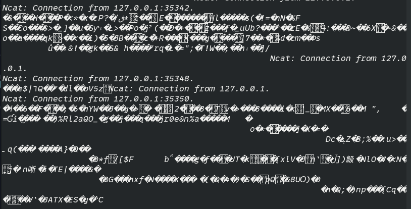

### LOON

## Purpose
- This is a tool used to take STDOUT from multiple generator binaries and send output to a target IP & Port
- Generator Binaries can be anything from raw packet data, to random characters. 

## Usage:
</img>

## Docker Image Available 4 Ease of Use:
```
cd docker && docker build . -f Loon.Dockerfile -t [Tag Name] --secret id=gitlab_token,src=~/secrets/gitlab-token --secret id=gitlab_username,src=~/secrets/gitlab-user
```

## Example Run:
1. Open a Port
```
nc -lvkp 6969
```

2. Create generator executables and put them in a directory

3. Run the app and specify the location of the executables

</img>

EXAMPLE OUTPUT ON TARGET SIDE:

</img>
